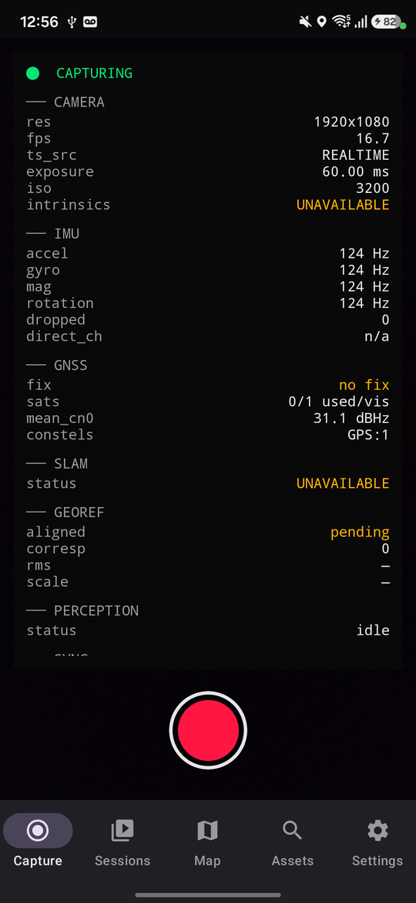
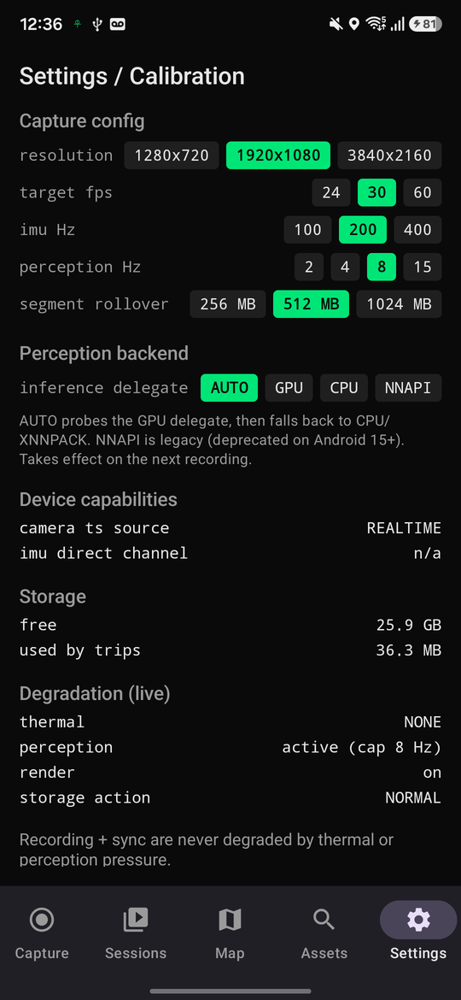
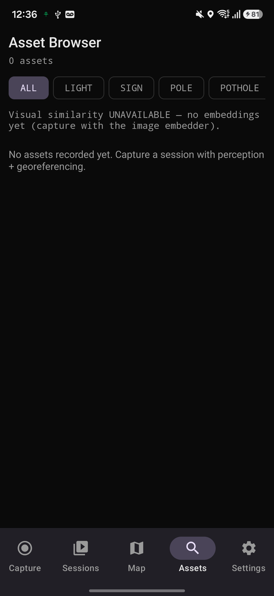

# MapPilot

**Turn any Android phone into a georeferenced mobile-mapping and Visual-Inertial SLAM rig.**

MapPilot records time-synchronized camera, IMU, and GNSS, tracks the device in 3D with ARCore VIO, fuses it to real-world coordinates, detects road assets on-device with a GPU-accelerated neural net, and writes everything to an open, reference-validated data format. It runs fully on the edge. No cloud required.

<p align="center">
  
  
  
  
  
  
</p>

<p align="center">
  
  &nbsp;&nbsp;
  
  &nbsp;&nbsp;
  
</p>

<p align="center"><sub>Left: live capture telemetry (camera, IMU, GNSS, SLAM, perception). Center: editable config with on-device GPU delegate selection. Right: on-device asset browser with visual-similarity search.</sub></p>

---

## Real captures from the field

A sparse point cloud from a single on-device session on a Galaxy A17, about 1.2 km on foot, 47,839 points after confidence filtering.

<p align="center">
  
</p>

More renders and the raw colored point clouds (`.ply`, open in CloudCompare or MeshLab) are in [docs/samples](docs/samples). These particular clouds are in the local VIO frame, not yet georeferenced, so the height spread is visual-inertial drift over the walk; the Geospatial (VPS) path turns this into absolute WGS84.

---

## Why MapPilot is different

Most mapping apps either stream raw video to a server or fabricate plausible looking results when a sensor is missing. MapPilot does neither.

* **Edge first.** Capture, SLAM, georeferencing, object detection, spatial search, and visualization all run on the device. The cloud is an optional, well-defined contract, never a dependency.
* **Never fabricates data.** If a sensor or model is unavailable, the app says so loudly (it shows `UNAVAILABLE` or `DEGRADED`) instead of inventing a value. Every cloud-derived artifact carries explicit provenance.
* **Recording is sacred.** Perception, upload, thermal pressure, and storage pressure can be throttled or paused, but they can never degrade or block the capture and synchronization path.
* **One clock for everything.** Every sensor stream is normalized to a single monotonic timebase, so the recorded data is genuinely fusable after the fact.

---

## Features

### Capture
* Synchronized Camera + IMU + GNSS capture with per-stream health monitoring (rate, drift, latency, gaps, drops).
* Six IMU streams (accelerometer, gyroscope, magnetometer, rotation vector, gravity, linear acceleration).
* Full GNSS view: fix, per-satellite C/N0, constellations, and raw measurements where the device exposes them.
* Live telemetry HUD that reports real values only.

### SLAM and georeferencing
* ARCore Visual-Inertial Odometry for 6-DoF pose, sparse point cloud, depth, and camera intrinsics.
* Keyframe selection driven by motion and time.
* GNSS to VIO alignment using a Umeyama similarity solve, producing a georeferenced trajectory in a local ENU frame and WGS84 coordinates.
* Non-finite poses and degenerate alignments are rejected rather than persisted.

### On-device perception
* YOLO11n object detection through LiteRT with automatic GPU delegate selection and a safe CPU and XNNPACK fallback.
* Backprojection of detections to metric 3D using ARCore depth, then cross-frame tracking and de-duplication into georeferenced assets.
* MobileNetV3 image embeddings for visual-similarity search across assets, computed on device.

### Data, storage, and export
* Custom Kotlin MCAP writer: chunked, indexed, CRC-checked, segmented, and self-describing through embedded Protobuf schemas. Validated against the reference MCAP tooling.
* H.264 MP4 video via MediaCodec, with a frame-to-timestamp sidecar.
* Crash recovery that finalizes interrupted recordings on next launch.
* Room database with an R-Tree spatial index and exact cosine vector search, paged for very large datasets.
* Export to PLY, PCD, GeoJSON, and CSV, plus provenance-tagged cloud processing jobs.

### Visualization
* Offline MapLibre Native map with multi-session trajectories and an asset density heatmap.
* GLES3 point-cloud renderer with camera keyframe frustums.
* Per-session quality analytics computed from the recorded data.

### Reliability and hardening
* Thermal and storage degradation policies that protect recording and sync at all costs.
* Resumable, chunked, SHA-256 verified uploads through WorkManager, with background job-status polling.
* Built for Android 15 and 16 with 16 KB native page alignment and 64-bit only binaries.

---

## How it works

```
   Camera        IMU x6        GNSS
      |            |             |
      +------------+-------------+
                   |
          Single monotonic timebase (elapsedRealtimeNanos)
                   |
        +----------+-----------+
        |                      |
   MCAP + MP4            ARCore VIO  +  GNSS fusion (Umeyama)
   (lossless record)            |
        |                  georeferenced trajectory (ENU, WGS84)
        |                      |
        |             YOLO11n (GPU) detections
        |                      |
        |        backproject -> track -> georeferenced assets
        |                      |
        |             image embeddings (visual similarity)
        |                      |
        +-----------+----------+
                    |
   Spatial + vector database  ->  Map | 3D | Export | Cloud jobs
```

The capture path on the left always runs to completion. Everything on the right is best effort and decoupled, so a busy GPU or a missing GNSS fix never disturbs the recording.

---

## Tech stack

* **Language and build:** Kotlin 2.0, Gradle 8.11 with convention plugins, AGP 8.7, JDK 17.
* **Architecture:** Clean Architecture with MVVM, 25 Gradle modules, an in-process event bus over typed events.
* **DI and async:** Hilt, Coroutines, and Flow.
* **SLAM and geometry:** ARCore, a hand-rolled Umeyama similarity solver, and WGS84 geodesy.
* **Perception:** LiteRT (TensorFlow Lite) with the GPU delegate, YOLO11n, and a MobileNetV3 embedder.
* **Storage:** Room with R-Tree spatial indexing and vector search.
* **Visualization:** MapLibre Native and OpenGL ES 3.
* **Recording:** a custom MCAP writer and MediaCodec.

---

## Build and run

Requirements: JDK 17 and the Android SDK (compileSdk 35, minSdk 31). An ARCore capable device is recommended for full SLAM.

```bash
git clone https://github.com/Sherin-SEF-AI/MobileSLAM.git
cd MobileSLAM

# Build the debug APK
./gradlew :app:assembleDebug

# Install on a connected device
adb install -r app/build/outputs/apk/debug/app-debug.apk

# Run the test suite
./gradlew testDebugUnitTest
```

Grant Camera and Location permissions on first launch, then press record. For georeferenced assets, record outdoors so the device can obtain a GNSS fix.

---

## Design principles

1. **Production only.** No placeholders and no stub data anywhere in the shipping paths.
2. **Honesty over guesses.** Unavailable capabilities surface as `UNAVAILABLE` or `DEGRADED`, with a reason.
3. **Provenance everywhere.** On-device and cloud-refined artifacts are always labeled.
4. **Determinism where it matters.** Pure geometry, time-sync, and data-format code is unit tested off device.

---

## Project status

MapPilot is feature complete across its capture, SLAM, perception, storage, visualization, export, and cloud-client layers, and has been field-tested on a Samsung Galaxy A17 running Android 16. On-device validation confirmed GPU-accelerated detection, configuration persistence, trip management, and reference-validated MCAP output.

### Roadmap
* Shared-camera path so ARCore, video, and perception share one camera stream at full frame rate.
* Outdoor validation of end-to-end georeferencing and visual-similarity search at scale.
* Optional text-to-image semantic search with a CLIP-aligned model.

---

## License

License to be determined. Please contact the author before reuse.
