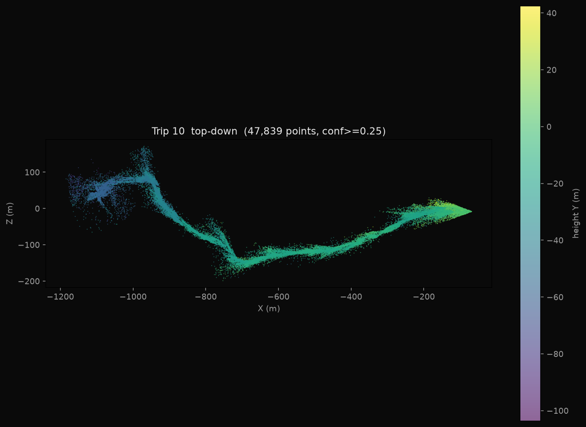

# On-device capture samples

Real point clouds recorded on a Samsung Galaxy A17 (Android 16) with MapPilot, then
filtered to confidence >= 0.25 and rendered offline.

| Trip | Points | Extent | Files |
|------|--------|--------|-------|
| 10 | 47,839 | ~1.2 km traverse | `trip10_topdown.png`, `trip10_3d.png`, `trip10_cloud.ply` |
| 11 | 16,472 | ~250 m | `trip11_topdown.png`, `trip11_3d.png`, `trip11_cloud.ply` |

The `.ply` files are colored by height and open in CloudCompare, MeshLab, or any
point-cloud viewer.

## Important: these are VIO-frame clouds, not georeferenced

GNSS alignment did not lock on these sessions (the trips report 0 m distance and a
0 GNSS score), so the points are in the local ARCore VIO coordinate frame, not in
WGS84. Two things follow from that:

- The vertical (height) spread you see is mostly ARCore VIO drift accumulating over
  a long walk, not real terrain.
- To place these on a map in absolute coordinates, the session needs either a clean
  GNSS fix captured at low speed, or the ARCore Geospatial (VPS) path enabled with
  an API key. Both are wired in the app; VPS needs `AR_API_KEY` in `local.properties`
  and VPS coverage at the location.

The raw, full-rate data for every session (synchronized camera, IMU, GNSS, poses,
and the unfiltered cloud) lives in each trip's MCAP on the device.
